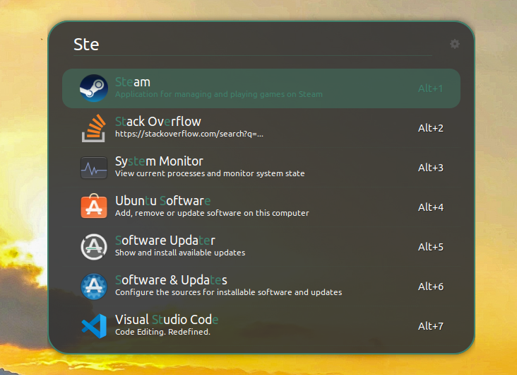
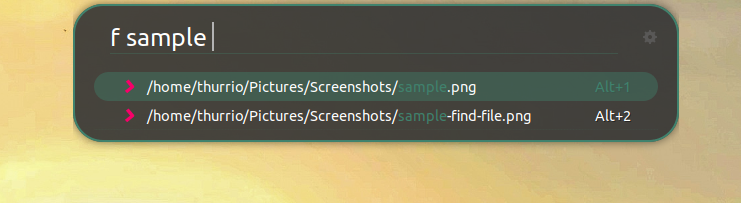
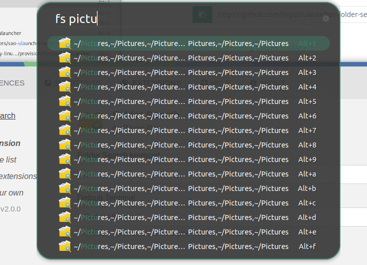

# ulauncher-viridian-theme
A simple theme green viridian to ulauncher

## Screenshots







## Installation

```sh

mkdir -p ~/.config/ulauncher/user-themes/Viridian
git clone https://github.com/arthurrio/ulauncher-viridian-theme \
  ~/.config/ulauncher/user-themes/Viridian

```
# Credits
I utilized the [Tokyo Night theme](https://github.com/SirHades696/TokyoNight-Ulauncher-Theme) as a foundation for my project. 
My work is inspired by and references the TokyoNight theme.
TokyoNight is inspired by [Surendrajat project](https://github.com/Surendrajat/SeaOwl-Ulauncher-theme)   
